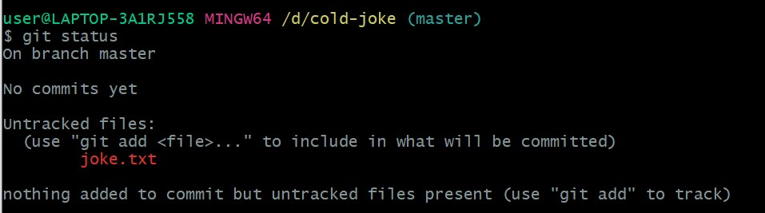
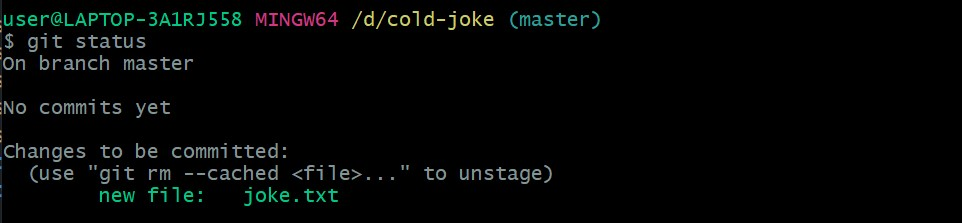

## 跟你朋友介紹 Git

菜哥，因為你不是要當工程師，所以我就不跟你講太多 Git 背後的細節了。不過我跟保證，在你學完後你絕對可以讓你的每個版本的冷笑話都保存起來，而且你隨時都可以切換到你想要的版本。

如果你怕記不起來也沒關係，只要你想用 Git 時，隨時打開這篇文章來看就馬上又懂了。

在正式開始之前，必須先告訴菜哥一件事。要學 Git 的話，得先學一些基本的 command line 指令，還有安裝 Git 這個軟體。你可以參考我寫給 h0w 哥的 [這篇文章](https://github.com/jubeatt/mentor-program-5th-jubeatt/blob/week1/homeworks/week1/hw3.md)）

那麼，讓我們從一步一步來吧。

首先，你先建一個資料夾，用來放你的冷笑話文字檔案：

```bash
mkdir cool-joke
```

接著我們進到這個資料夾：

```bash
cd cool-joke
```

接著我們來建立一個冷笑話的文字檔案：

```bash
touch joke.txt
```

接著你就可以把你的冷笑話寫在 joke.txt 這個檔案裡面了。如果你覺得用 CLI 的方式來寫太麻煩的話，你可以直接去你的資料夾裡面找到 joke.txt，然後用你熟悉的方式來撰寫就好了。

接著，在你寫好「第一個版本的冷笑話」後，我們就來用 Git 儲存第一個版本吧！

首先，因為我們要讓 Git 來幫我們做版本控制，所以可以用 `git init` 來跟 Git 說：「Git，幫我做版控好嗎？尼逆（init）！」

（請在 cool-joke 這個資料夾的位置使用這個指令）

```bash
git init
Initialized empty Git repository in D:/cold-joke/.git/
```

看到 `Initialized empty Git repository in D:/cold-joke/.git/` 就 OK 囉，代表 Git 決定幫你做版本控制。

接下來，我們輸入 `git status` 這個指令來問 Git：「嗨嗨，現在是什麼情況？」

然後你應該會看到這個畫面：



請原諒 Git 的中文不好，所以我來解釋給菜哥聽吧。

是這樣的，雖然 Git 已經決定要幫我們做版控了，但是我們還沒有告訴 Git 「要對哪一個檔案做版控？」，所以 Git 的意思是說：

「現在資料夾裡面有一個 joke.txt，它還沒有被我控制。如果你想我要對它做控制的話，請用 `git add` 告訴我一下」

偷偷告訴菜哥一個撇步，Git 知道自己的中文不好，所以 Git 也很貼心的用「顏色」來表示「這個檔案有沒有被我控制」：

- 「紅色」代表沒有被 Git 控制
- 「綠色」代表被 Git 控制

所以菜哥如果沒有色盲的話，應該會看到在剛剛 Git 的回答中，joke.txt 是紅色的。

接著，因為我們希望 Git 幫我們對 joke.txt 做控制，所以我們按照 Git 說的，輸入 `git add` 這個指令：

```bash
git add joke.txt
```

因為我們要告訴 Git 是哪一個檔案，所以 `git add` 的後面要加上「檔案名稱」，很合理吧？

接著我們再用一次 `git status` 問 Git：「嗨嗨，現在是什麼情況？」



菜哥應該注意到了吧？現在 joke.txt 變成綠色的了，代表 Git 現在已經幫我們控制這個檔案了！

但是還沒結束，Git 這個人做事非常謹慎，就算它答應幫你控制這個檔案，你還是需要再做一件事來跟他做「最後的確認」。

跟 Git 做最後確認的指令是 `git commit -m`，為了方便理解，我就直接操作給菜哥看吧：

```bash
git commit -m '菜哥的第一個冷笑話'

[master (root-commit) 74a2fc2] 菜哥的第一個冷笑話
 1 file changed, 0 insertions(+), 0 deletions(-)
 create mode 100644 joke.txt
```

如果菜哥看到的結果跟上面一樣的話，就代表成功了哦哦哦哦！

至於 `git commit -m` 是什麼意思，怎麼好像跟剛剛前面的指令不太一樣，還有那個 `-m` 是怎樣？

別急，我們一個一個解釋清楚：

1. `git commit` 的意思是告訴 Git：「我已經確定好了」
2. `-m` 是用來告訴 Git，關於這個版本你想表達什麼，你可以寫一下關於這個版本的內容是什麼
3. `'菜哥的第一個冷笑話'` 就是關於這個版本我們想說的訊息，如果菜哥想改成「鳥哥的 Linux 私房菜」也行啦。

最後菜哥你可能還有個疑問：阿我現在要怎麼知道 Git 是不是真的有幫我儲存第一個冷笑話？

這個就是我接下來要交你的指令：`git log`

```bash
git log

commit 74a2fc2ffa76366b0b44c4c525860c1358ddebae (HEAD -> master)
Author: jim <jimdevelopesite@gmail.com>
Date:   Tue Dec 14 22:08:50 2021 +0800

    菜哥的第一個冷笑話

```

`git log` 可以查看你每一個版本的內容，裡面會寫說：

1. 你是在什麼時候建立這個版本的（Date）
2. 這個版本的內容主要是什麼？（菜哥的第一個冷笑話）
3. 建立這個版本的人是誰（Author）
4. 這個版本的編號（commit），請特別留意這個，之後要切換不同版本的時候都需要用這個編號來做切換

### 中場休息一下

OK，學到這裡其實就差不多了，所以幫菜哥複習一下流程：

1. 一開始要先用 `git init` 來叫 Git 幫我們做版本控制
2. 用 `git add 檔案名稱` 告訴 Git 幫我們對哪一個檔案做版本控制
3. 用 `git commit -m '版本訊息'` 來跟 Git 做最後確認，還有我們想儲存的訊息
4. 用 `git log` 來查看 Git 幫我們儲存的版本

### 說好的切換版本呢？

我...我沒有忘啦，只是正好剛要教你而已！

我們不是有說過 `git log` 可以看到每個版本的「編號」嗎？

對，就是你想的那樣子，我們只要用那個編號來做切換就可以了：

```bash
git checkout 74a2fc2ffa76366b0b44c4c525860c1358ddebae

Note: switching to '74a2fc2ffa76366b0b44c4c525860c1358ddebae'.

You are in 'detached HEAD' state. You can look around, make experimental
changes and commit them, and you can discard any commits you make in this
state without impacting any branches by switching back to a branch.

If you want to create a new branch to retain commits you create, you may
do so (now or later) by using -c with the switch command. Example:

  git switch -c <new-branch-name>

Or undo this operation with:

  git switch -

Turn off this advice by setting config variable advice.detachedHead to false

HEAD is now at 74a2fc2 菜哥的第1個冷笑話

```

其實重點只有：`Note: switching to '74a2fc2ffa76366b0b44c4c525860c1358ddebae'.` 這句。看到這句就代表你切換成功囉！

如果要切換成其他的版本也是用同樣的方法就可以了。

### 留給菜哥的參考文章

針對菜哥的用途來說，這些指令應該就很夠用了，如果菜哥了解關於 Git 的更多細節的話，可以參考我做的筆記：

- [Git 指令](https://jubeatt.github.io/2021/12/13/git-instruction/)
- [在學版本控制前，先理解三件事](https://jubeatt.github.io/2021/12/12/what-is-version-control/)
- [從自己做版控來學 Git](https://jubeatt.github.io/2021/12/12/create-your-own-version-control/)
- [從資料夾來理解分支的概念](https://jubeatt.github.io/2021/12/12/easy-way-to-understand-branch/)
- [解決 Git 中的衝突（Conflict）](https://jubeatt.github.io/2021/12/12/fix-the-conflict-of-git/)

### 給菜哥的 Q & A

接下來的部分是菜哥你可能日後會碰到的問題，所以先預留在這給你做個參考。

1. 當我切換到以前的版本後，想用 `git log` 查看最新的版本編號時，卻發現沒有顯示目前版本之後的資訊，，那我該怎麼辦？

   請用 `git checkout master`，就可以切回去了

2. 我 commit 訊息打錯了怎麼辦？

   請用 `git commit --amend` 進到 vim 的編輯器裡面修改

3. 我還沒有 commit，但我剛剛改的東西不要了

   請用 `git restore 檔案名稱` 就可以囉

4. 我不小心 commit 了，還可以後悔嗎？  
   `git reset HEAD^ --hard`，我剛剛發的 commit 跟做的東西我全都不要了。  
   `git reset HEAD^ --soft`，我只是收回 commit，但我內容還要留著。  
   `git reset HEAD^ --mixed`，跟 –soft 的效果一樣，差別只在於 –mixed 會退回到 Untracked 的狀態。
