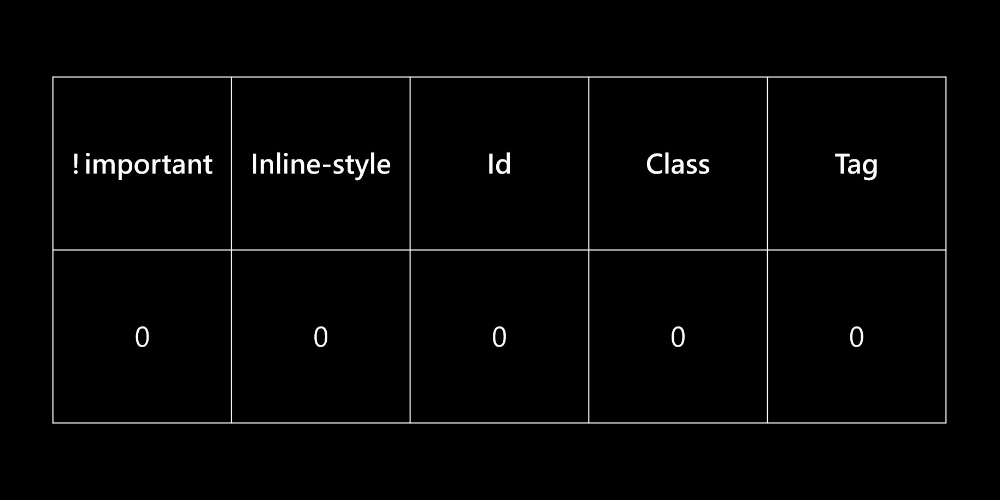

## Webpack 是做什麼用的？可以不用它嗎？

簡單來說，Webpack 主要是一個用來把「模組」給打包的工具。除了打包，還有一些其他功能，但這邊不會細講。

至於在問能不能不要用 wepback 之前，先思考看看這兩個問題：

1. 你需要考慮瀏覽器支援度嗎？因為並不是所有瀏覽器都支援 ES Modules 
2. 你會用到外部套件嗎？像是從 npm 上下載的套件？因為 ES Module 沒辦法直接讓你引入

如果你不需要考慮這些，那你就可以不要用，因為大部分用 webpack 的主要目的是想解決這兩個問題。


接下來，我想先釐清一下關於「模組化」的正確觀念。

過去在瀏覽器上要用套件，通常是透過 `src` 來引入，例如 jQuery：

```html
<!-- jQuery -->
<script src="https://cdn.jsdelivr.net/npm/jquery@3.6.0/dist/jquery.min.js"></script>
<script>
  // 接著在這裡就能用 $ 或 jQuery 來使用
</script>
```

我要特別強調**這個不叫做模組化**，為什麼？因為這已經汙染到「全域變數」了。

所謂的模組化，應該要像是在 Node.js 上用 `require` 的方式來引入套件：

```js
// 能夠自己定義模組名稱
const myjQuery = require('jquery');
// 或是只引入我想要的東西
const { ajax } = require('jquery');
```

OK，到這裡你應該已經理解什麼叫做模組化，接著來回顧一下歷史。

大家都知道在 ES6 推出「ES module」之前，瀏覽器只能透過 `src` 來引入套件。所以問題來了，在 ES module 推出之前完全就沒辦法用模組嗎？

不是的，不要忘了前端的那句名言：

> 瀏覽器沒有支援的東西，就寫一個工具來讓它可以支援就好。

所以就有人寫了 [Browserify](https://browserify.org/) 來讓你可以在瀏覽器上也用 `require` 的方式來引入套件，而 webpack 也是從 Browserify 的概念延伸出來的工具，只是它又更強大了一點。

可是你應該會有個疑問，為什麼 ES module 推出後還需要用 webpack 呢？不是瀏覽器就能原生支援嗎？

這個問題以前我也想很久都搞不懂。不過現在我理解了。

沒錯，ES module 確實是瀏覽器原生支援的東西，可是它有最開始提到的那兩個問題：

1. 瀏覽器支援度，比較舊的瀏覽器不支援
2. 沒辦法引入從 npm 上下載的套件

還有一些其他的小問題，像是得在 `<script>` 上加 `type=module` 和得搭配 server 來開發之類的。

總之呢，問題在於**ES module 還是沒有那麼方便使用**，這個就是用 webpack 最主要的原因了。

所以 webpack 到底好用在哪？不如直接看個示範吧！

如果我想要引入用 npm 下載的 jquery，我可以開一支檔案來寫 jQuery：

```js
// CommonJS
const myjQuery = require('jquery');
myjQuery('body').css('background-color', 'rgba(0, 255, 0, 0.2)');
myjQuery('.btn').on('click', () => console.log('click'));

// ES modules
import jq from 'jquery';
jq('body').css('background-color', 'rgba(0, 0, 255, 0.2)');
jq('.btn').on('click', () => console.log('click'));
```

不管我要在裡面用 CommonJS 或 ES modules 來引入都沒問題。我只要記得寫好後用 webpack 打包，接著在 HTML 裡面加上一句：

```html
<!-- 打包好的模組 -->
<script src="./bundle.js"></script>
```

不需要再 `type=module`，也不需要開 server，拿去瀏覽器上就是直接可以跑。這個就是 webpack 強大的地方。**明明我寫的不是瀏覽器支援的東西，卻可以讓它看起來就像有支援一樣。**

為什麼可以這樣？可以想成是 webpack 在瀏覽器上實作了 `require` 或 `import` 這兩個 function，這樣比較好理解。

除此之外，webpack 還有更多的功能，像是：

1. 把要引入的 JavaScript 先用 babel 編譯後再打包
2. 明明是在 JS 裡，卻可以引入 CSS，或甚至是 SCSS
3. 跟第一點同理，如果引入的是 SCSS，可以先編譯成 CSS 後再打包

總之這邊不打算細談，只是點出來讓大家知道 webpack 可以做到這些事情而已。

所以為什麼現代前端開發幾乎 90% 都會用 webpack？

>因為它太方便了，很難找到不用它的理由。

沒錯，就是這麼簡單又暴力的答案。


## gulp 跟 webpack 有什麼不一樣？

gulp 是用來「管理任務」的工具，例如說：

```js
const { src, dest, parallel, series } = require('gulp');
const babel = require('gulp-babel');
const uglify = require('gulp-uglify');
const rename = require("gulp-rename");
const sass = require('gulp-sass')(require('sass'));
const cleanCSS = require('gulp-clean-css');

/*
  第一個任務：
  1. 用 babel 編譯 JS
  2. 壓縮
  3. 重新命名後輸出 
*/
function complieJS () {
  return src('src/*.js')
    .pipe(babel())
    .pipe(dest('js/'))
    .pipe(uglify())
    .pipe(rename('min.js'))
    .pipe(dest('js/'));
}

/*
  第二個任務：
  1. 用 sass 編譯 scss
  2. 壓縮
  3. 重新命名後輸出 
*/
function complieCSS () {
  return src('src/*.scss')
    .pipe(sass().on('error', sass.logError))
    .pipe(dest('css/'))
    .pipe(cleanCSS())
    .pipe(rename('min.css'))
    .pipe(dest('css/'));
}
// 同時進行
exports.default = parallel(complieJS, complieCSS);
// 一個一個進行
exports.default = series(complieJS, complieCSS);
```

你可以先設計好一大堆的任務，再叫 gulp 來幫你執行，這個就是 gulp 在做的事情。


那 webpack 又跟它差在哪裡？

> 差多了好嗎？

前面已經說過，webpack 是一個**用來把模組給打包的工具**，大部分會搞混是因為 webpack 自帶一些額外功能，像是：

1. 用 babel 編譯 JavaScript
2. 把 SCSS 編譯成 CSS 
3. 把檔案用 minify 給壓縮

確實有點像 gulp 在做的事情，但這不是 webpack 的「本質」。它的本質終究還是「把資源給打包」這件事，只是在打包前後你可以順便對這些資源做一些事情。

接下來我來舉一個 gulp 可以做到，但 webpack 做不到的事情：

```js
/*
  1. 幫我用 JS 寫一段 code
  2. 複製 10 份
  3. 輸出到 js/ 底下
*/
function createJS () {
  return src('src/*.js')
    .pipe(jsAutoWrite())
    .pipe(duplicate(10))
    .pipe(dest('js/'))
}
exports.default = createJS;
```

這邊只是我唬爛的，gulp 並沒有這些套件能用。重點是你要能分清楚這兩個的差別，一個是「管理任務」，一個是「把資源打包」。

## CSS Selector 權重的計算方式為何？

先來一個我覺得非常棒的圖：



接下用例子來說明：


```css
/* 0 0 0 1 0 */
.box {
  color: red;
}
/* 0 0 0 1 1 */
.box p {
  color: blue;
}
/* 0 0 0 2 2 */
.box > p > .child > p {
  color: yellow;
}
/* 0 0 1 0 0 */
#myText {
  color: green;
}
/* 1 0 0 0 0 */
p {
  color: purple !important;
}
```

每當選取一個 class，class 的欄位就 + 1，每當選取一個 tag，tag 的欄位就 + 1，以此類推。

但是要特別強調一點：

- **請把數字分開來看，不要合在一起看，**
- **請把數字分開來看，不要合在一起看，**
- **請把數字分開來看，不要合在一起看，**

例如說我選了 11 個 tag 跟 1 個 class：

```css
/* 11 */
div > div > div > div > div
div > div > div > div > div {
  color: red;
}
/* 10 */
.yoyo {
  color: blue;
}
```

你可能就會以為 11 比 10 大，所以 `div` 贏過 `.yoyo`，但不是這樣，你應該要這樣看：

```css
/* 0 0 0 0 11 */
div > div > div > div > div
div > div > div > div > div {
  color: red;
}
/* 0 0 0 1 0 */
.yoyo {
  color: blue;
}
```

什麼意思？意思是 **class 永遠就是比 tag 大**，你就算選再多 div 也一樣，不是逢 10 就能進位。

所以如果想蓋掉一個 `!important`，就只能也用 `!important` 才有辦法。這就是為什麼一堆人會跟你說沒事不要隨便用 `!important` 的原因，因為它的權重太高了。