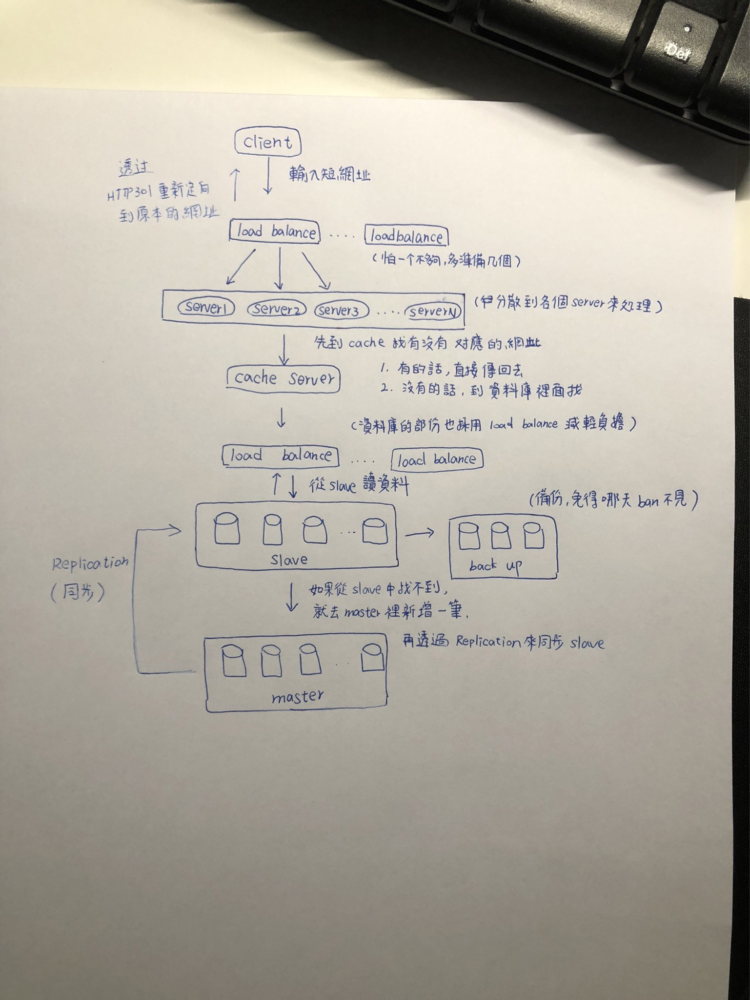

# hw1：短網址系統設計

可能有點小，建議放大來看（好久沒動筆了...）。

簡單敘述一下流程：

1. 輸入一個短網址，發出 request。
2. 先由 load balance 接收，並分散給不同的 server 來處理（減輕負擔）。
3. server 會先到 cache 裡面找有沒有存在的網址，有的話就直接回傳，不必再到資料庫撈。
4. cache 裡如果沒有，就到資料庫裡面找。
5. 進入資料庫以前，一樣由 load balance 來分散流量，減輕資料庫負擔。 
6. 從 slave 裡找有沒有網址，如果有的話就傳回去。
7. 如果 slave 找不到，就對 master 新增一筆紀錄，並透過 replication 來同步到每個 slave
8. 接著會順便做 backup（備份），避免資料庫哪天突然壞掉。

總之呢，最後就會回傳一個 HTTP 301 的重新定向，把使用者導向短網址所對應的地方。