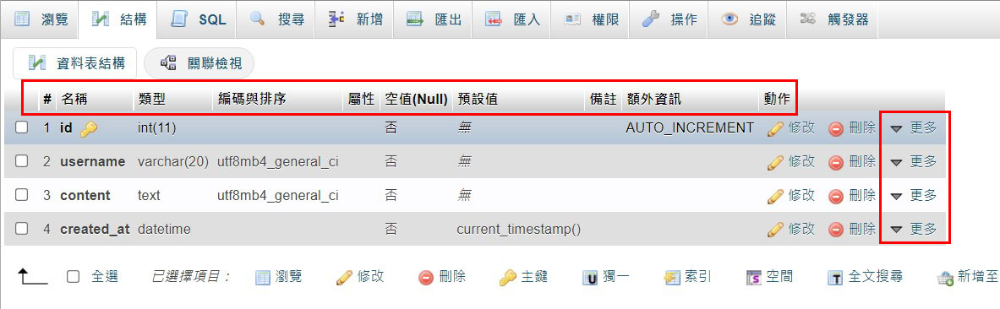

## 什麼是 DNS？Google 有提供的公開的 DNS，對 Google 的好處以及對一般大眾的好處是什麼？

DNS（Domain Name System），中文是「網域名稱系統」。

簡單來說就是「把網址做轉換」，要轉換什麼東西？把「域名」轉換成「IP 位址」。

例如 `google.com` 經過 DNS 處理後就會得到 `172.217.163.46`，你也可以打開你的 CLI 輸入：

```bash
nslookup google.com
```

就會得到這樣的結果：

```bash
Non-authoritative answer:
Server:  dns.hinet.net  # 誰提供 DNS 給你？（這邊是 hinet）
Address:  2001:b000:168::2 # IPv6

Name:    google.com # 域名
Addresses:  2404:6800:4012:1::200e # IPv6
          172.217.163.46 # IPv4
```

至於為什麼要用 DNS ？因為瀏覽器其實看不懂 `google.com` 代表哪台主機，它只看得懂 `172.217.163.46`。可是如果要我們用 `172.217.163.46` 才能連到 google 的話也太不直覺了吧？所以才有人發明了 DNS 來解決這個問題。


### 關於 google 提供的 DNS 服務


對一般人的好處是，如果哪天自己的 DNS 突然掛掉了，就可以先用 google 提供的 DNS 來搶救一下，可以想成是備援方案的感覺吧？或其實你也可以直接拿 google 的來用，畢竟不用錢嘛。

至於對 google 有什麼好處？你先可以想想 DNS 的運作流程，答案就出來了：

```
abc.com -> 經過 google DNS 轉換成某個 IP 位址 -> 把 IP 位址傳回 Client
yoyo.com -> 經過 google DNS 轉換成某個 IP 位址 -> 把 IP 位址傳回 Client
awesome.com -> 經過 google DNS 轉換成某個 IP 位址 -> 把 IP 位址傳回 Client
```

發現了嗎？不管你想到哪個網站，都一定會先經過 **google DNS 轉換** 的這個動作。

這代表什麼？代表只要有人使用 google 提供的 DNS，google 就可以從中得知你去了哪個網站。而這些資訊重不重要？

> 重要阿，不然為什麼會有大數據這種東西？


## 什麼是資料庫的 lock？為什麼我們需要 lock？

我覺得可以想成是「一次只處理一個 request」（精確一點來說應該是一次只處裡一個 transaction）。

例如說現在有某樣商品的數量剩下一個，而 A 跟 B 同時（分秒不差的那種）發出購買的 request，那會發生什麼事情？

照理來說應該只能有一個人購買成功，可是會因為「race condition」的關係，導致結果有可能會是 **A 跟 B 都購買成功**。這樣就不對了，所以我們需要有一個機制，讓資料庫在**處理 A 時不可以同時處理 B**，這個機制就是「lock」。

OK，以上就是 lock 的作用，想看例子的話可以參考我寫的文章：[資料庫中的 Transaction 與 Lock](https://jubeatt.github.io/2022/03/03/transaction-and-lock/)

## NoSQL 跟 SQL 的差別在哪裡？

SQL 的中文是「結構化查詢語言」，所以它本身是一個「程式語言」，或者說是給「關聯式資料庫」用的程式語言。也因為它是給關聯式資料庫用的，所以後來把 SQL 當成是一個統稱，代表某個關聯式資料庫。例如：MySQL 是一個屬於 SQL 的資料庫。

所以 NoSQL 跟 SQL 的概念很像，一樣能當作是個統稱，它的全文是「Not Only SQL」，很明顯的，它指的是「非關聯式資料庫」。

那實際上差別在哪？最主要是差在**儲存資料的方式**。

一個 SQL 的 table 通常會有預先定義好的結構（Schema）：




但 NOSQL 沒有結構的概念，它是用類似 JSON 的方式來儲存：

```js
users: {
  user1: {
    username: 'PeaNu',
    age: 20,
    created_at: 2021-03-01-22-03-30,
  },
  user2: {
    username: 'PeaNu',
    age: 20,
    created_at: 2021-03-01-22-03-30,
  },
}
```

NOSQL 的一個好處是，要添加新欄位的時候比較輕鬆，不用像 SQL 還要去重新定義結構。但應該還是各有優缺點，並不是 NOSQL 就一定比 SQL 好，建議有興趣的話再自己查查看囉。


## 資料庫的 ACID 是什麼？

我覺得在講 ACID 之前，先理解 transaction 是什麼會比較有幫助，所以這裡先解釋一下 transaction 是什麼。

先來看一下維基百科對 transaction 的定義：

> 資料庫交易（簡稱：交易）是資料庫管理系統執行過程中的一個邏輯單位，由一個有限的資料庫操作序列構成。

好，應該有看沒有懂，我也一樣。

總之呢，這邊只要把重點放在「單位」這個詞就好。可是還是有點抽象，什麼叫做單位？

來舉個例子吧，假設我有一個操作是「把 A 轉 20 塊給 B」，要完成這項操作會需要兩個 SQL 指令：

1. 把 A 的錢扣 20 塊
2. 把 B 的錢加 20 塊


我們會把 1 跟 2 都當成是一個 transaction，第一個 transaction 是「把 A 的錢扣 20 塊」，另一個是「把 B 的錢扣 20 塊」。所以說呢，現在有「兩個」transaction，這個就是單位的意思。

好，這跟 ACID 又有什麼關係？

這要先談一下 transaction 本身的問題，有些時候我們無法確保一個 transaction 的結果會如我們所想。像上面的例子，如果 A 只有 20 塊，在 A 的錢還沒被扣掉時，突然又插入一個新的操作是把 A 的錢轉給 C，這個時候就有可能出現**明明 A 只有 20 塊卻轉了 40 塊給 B 和 C 的結果發生**。

這樣的 transaction 是不好的，我們希望盡量避免這種事情發生，所以才建立了一套原則，就是 ACID：

- Atomicity 原子性：要嘛全部成功 or 失敗
- Consistency 一致性：資料的總數要一樣，例如 A 跟 B 的錢原本加起來有 100 塊，那不管他們轉幾次帳，最後加起來應該也要是 100 塊
- Isolation 隔離性：A 一次只能轉帳給一個人，如果要轉帳給下個人，就要等上個人結束後再轉給下個人。
- Durability 持久性：寫入的資料要放在一個可以永久保存的地方

這邊可能比較抽象，不過我覺得只要知道 ACID 是用來確保 transaction 的結果可以按照我們所想，這一點就夠了。專有名詞的部分只要看個概念就好，不用一定要完全理解。


