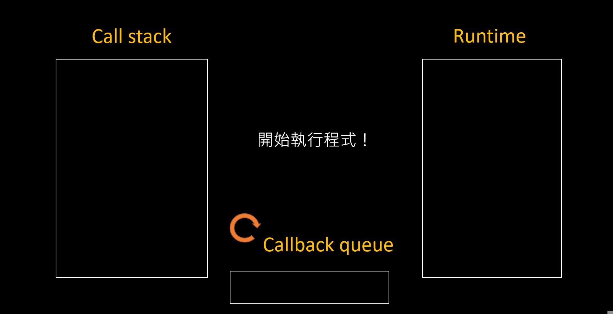

# Event loop 

```js
1 | console.log(1)
2 | setTimeout(() => {
3 |  console.log(2)
4 | }, 0)
5 | console.log(3)
6 | setTimeout(() => {
7 |   console.log(4)
8 | }, 0)
9 | console.log(5)
```

執行結果會是：

```js
1
3
5
2
4
```

最底下有附了一段我做的投影片，但建議看完文字解說後再滑下去看。

**進入 main 函式**

可以把 main 想成是把整段程式碼包起來的另一個隱藏 function，它才是真正第一個被放入 call stack 中的 function。

**Line1 console.log(1)**

把 `console.log(1)` 放到 call stack 中並且執行，所以就會在 console 中輸出 `1`。

**Line2 setTimeout(...)**

把 `setTimeout(...)` 放到 call stack 中並且執行。

這裡要知道 `setTimeout` 是 runtime（瀏覽器 / Node.js）提供的 API，所以這個 function 被呼叫時就會自動丟給 runtime 來處理。而 runtime 在這邊做的事情就是幫你設一個 0 毫秒的計時器，等時間到再丟給 callback queue。

**Line5 console.log(3)**

把 `console.log(3)` 放到 call stack 中並且執行，所以就會在 console 中輸出 `3`。

這個時剛剛設的 `setTimeout` 應該已經到了，所以就會被丟到 callback queue 中。

不過這時候 main 還在 call stack 裡，所以 Event loop 還不能把 callback queue 裡面的東西丟回去。

**Line6 setTimeout(...)**

把 `setTimeout(...)` 放到 call stack 中並且執行。

跟剛剛一樣，它會被丟給 runtime 來處理。

**Line9 console.log(5)**

把 `console.log(5)` 放到 call stack 中並且執行，所以就會在 console 中輸出 `5`。

這時後第二個設的 `setTimeout` 應該也已經到了，所以也會被丟到 callback queue 中。

**main 函式結束**

當執行到這裡時，call stack 中就不會有任何 function 了，所以可以**確定 call stack 會是空的**，這個時候 Event loop 就可以把 callback queue 裡面的東西丟回去給 stack 執行了。


所以接下來要執行從 callback queue 丟回給 call stack 的部分。

**執行第一個 setTimeout 的 callback**

1. 把 `callback` 放入 call stack
2. 執行 `callback` 
2. `callback` 中裡會再呼叫 `console.log(2)`
3. 把 `console.log(2)` 放入 call stack
5. 執行 `console.log(2)`，所以在 console 中輸出 `2`
6. 把 `console.log(2)` 從 call stack 移除
7. 把 `callback` 從 call stack 移除


**執行第二個 setTimeout 的 callback**

1. 把 `callback` 放入 call stack
2. 執行 `callback` 
2. `callback` 中裡會再呼叫 `console.log(4)`
3. 把 `console.log(4)` 放入 call stack
5. 執行 `console.log(4)`，所以在 console 中輸出 `4`
6. 把 `console.log(4)` 從 call stack 移除
7. 把 `callback` 從 call stack 移除


**所有程式執行完畢。**


最後是投影片的部分，如果有任何不懂的地方就拉回去上面看。


