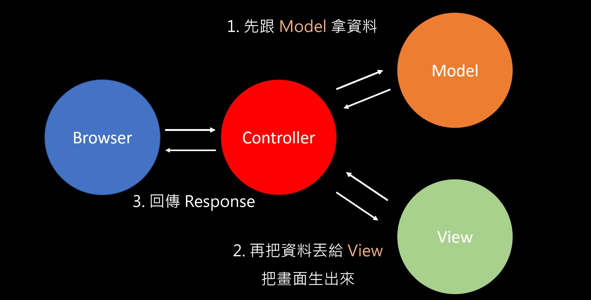

## 什麼是 MVC？

首先 MVC 是以下這三個字的縮寫：

- Model
- View
- Controller

簡單來說 MVC 是一種「架構」，可以讓你的程式看起來更有「結構」一點，而不是全部摻在一起變成撒尿牛丸。

寫過純 PHP 的我們都知道 code 會像下面這樣非常的雜：

```php
<?php
  require_once('conn.php');
  require_once('./session.php');

  // 防止訪客進入
  if (empty($_SESSION['username'])) {
    header('Location: index.php');
    die();
  }
?>

<!DOCTYPE html>
<html lang="en">
<head>
  // ...略
</head>
<body>

  <?php require_once('nav.php');?>


  <main class="main">
    <div class="container">
      <?php
        // 錯誤訊息
        if (!empty($_GET['errorCode'])) {
          $template = '
              <div class="row col-lg-8 mx-lg-auto mb-3">
                <div class="text-danger">錯誤：%s</div>
              </div>';
          $msg = 'Error';
          if ($_GET['errorCode'] === '1') {
            $msg = '資料不齊全，請重新輸入';
          }
          echo sprintf($template, $msg);
        }
      ?>
      <form action="./handle_admin_add_post.php" method="POST">
        <div class="row col-lg-8 mx-lg-auto mb-3">
          <div class="select-box">
            <select name="category" class="form-select" aria-label="Default select example">
              <option value="4" selected>Others</option>
              <?php
                $template = '<option value="%d">%s</option>';
                $sql = "SELECT * FROM categories ORDER BY id DESC";
                $stmt = $conn->prepare($sql);
                $stmt->execute();
                $result = $stmt->get_result();
                while ($row = $result->fetch_assoc()) {
                  if ($row['name'] === 'Others') {
                    continue;
                  }
                  echo sprintf($template, $row['id'], htmlspecialchars($row['name']));
                }
              ?>
            </select>
          </div>
        </div>

  // ...略

  <script src="./plug-in/ckeditor/ckeditor.js"></script>
  <script>
    ClassicEditor
    .create( document.querySelector( '#editor' ), {
      toolbar: [
        'heading', '|', 'bold', 'italic', 'code',
        'link','bulletedList','numberedList',
        '|','outdent','indent', '|',
        'blockQuote','insertTable','undo',
        'redo','codeBlock'
      ],
      indentBlock:{
        offset: 0.8,
        unit: 'em'
      },
      codeBlock: {
        languages: [
          { language: 'plaintext', label: 'Plain text' },
          { language: 'css', label: 'CSS' },
          { language: 'html', label: 'HTML' },
          { language: 'xml', label: 'XML' },
          { language: 'javascript', label: 'JavaScript' },
          { language: 'json', label: 'JSON' },
          { language: 'bash', label: 'Bash' },
          { language: 'sql', label: 'SQL' },
          { language: 'php', label: 'PHP' },
          { language: 'c', label: 'C' },
          { language: 'c#', label: 'C#' },
          { language: 'diff', label: 'Diff' },
          { language: 'java', label: 'Java' },
          { language: 'python', label: 'Python' },
          { language: 'ruby', label: 'Ruby' },
          { language: 'typescript', label: 'TypeScript' },
        ]
      }
    })
    .catch( error => {
        console.error( error );
    } );
  </script>
</body>
</html>
```

好極了，這隻檔案裏面充滿了 PHP、HTML、JavaScript，在加個 CSS 就可以去組 [4*TOWN](https://www.4town.com/) 了。

回歸正題，MVC 就是用來解決這種問題的，就如 M、V、C 這三個字本身的含意，它把結構分成三個部分：

- Model 資料庫 / 商業邏輯
- View 只負責根據資料做顯示
- Controller 跟 Model 拿資料 / 把資料給 View 做顯示




當然 MVC 好像還可以細分成多種變體吧，這不是唯一一種實現 MVC 架構的方式，只是我覺得這算是比較常見的一種形式。

所以拿這幾週寫 Express 來當範例，一個採用 MVC 的程式碼應該要會得像這樣：

1. Model

```js
const todos = ['first todo', 'second todo', 'third todo'];
const todoModel = {
  // 回傳所有 todo
  getAll: () => {
    return todos;
  },
  // 回傳單一 todo
  get: id => {
    return todos[id];
  }
}
module.exports = todoModel
```


2. Controller 

```js
// 把 Model 引進來，才能跟 Model 溝通
const todoModel = require('../models/todoModel');
const todoController = {
  // 先跟 Model 拿資料，在丟給 View
  getAll: (req, res) => {
    res.render('todos', {      
      // 要 render 的資料
      todos: todoModel.getAll()
    })
  }
}
module.exports = todoController
```

3. View

```js
// todos.ejs
<h1>Todos</h1>

<ul>
  <% for (const todo of todos) { %>
    <li><%= todo %></li>    
  <% } %>  
</ul>
```

像這樣子把職責拆出來，就不會有像寫純 PHP 那樣的問題，所以現在大多數的專案都會採用 MVC 來整合（雖然還是有老公司依然採用 Spaghetti Code 的方式來管理就是了）。


## 請寫下這週部署的心得


很開心學會了怎麼部署到 Heroko。

其實以前就很常聽到有人說可以用 Heroku 這個東西，但是我一直沒花時間去學習怎麼用，一是我當時完全沒有網路運作知識，二來是完全沒碰過資料庫，等於說我只能部署靜態網站，那幹嘛好好的 Github page 不用要跑去學 Heroku？太沒有吸引力了吧？（理直氣壯的幫自己找藉口


總之呢，這週部署下來的感想是，Heroku 是個很方便的平台，真的只要跑幾個指令和做一些設定就搞好了，不像虛擬主機還要自己弄作業系統啦、Apache 啦等等之類的，也怪不得很多人會推薦 Heroku 了。


## 寫 Node.js 的後端跟之前寫 PHP 差滿多的，有什麼心得嗎？

>舒舒服服。

就是這麼簡潔的答案！

雖然一開始還是要習慣一下突然從 PHP 切回去 JavaScript，不過寫一段時間後真的順手很多，尤其是搭配 MVC + ORM 的加持，簡直是回不去 PHP 了 XD

最滿意的地方有兩個，一是 View 寫起來非常直覺，純粹根據資料來做事就好，其他我完全不用管；二是 ORM 大大減輕了負擔，當不需要再寫 SQL 指令後世界變得很美好，真的只是在操作物件而已。

雖然我對目前後端的職場生態不是很了解，但如果也是用這種方式來開發的話，其實還蠻吸引人的 XD。
