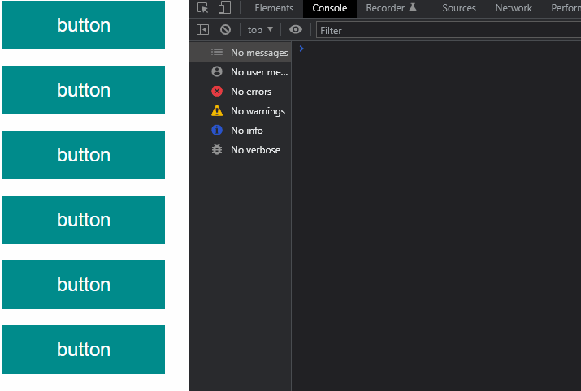
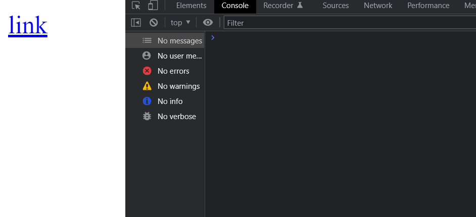
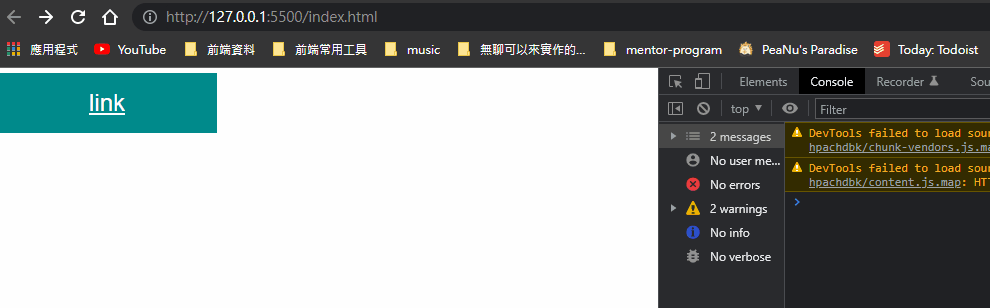
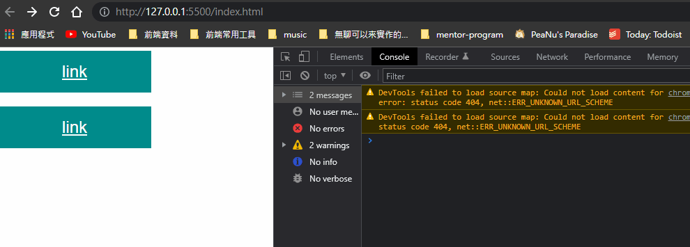
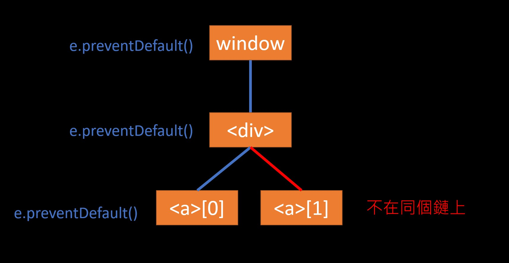

## 什麼是 DOM？

簡單來說 DOM 就是瀏覽器提供的一個 API。

我自己是把 DOM 想成是「把 HTML 包裝成物件」的一個模型，例如說：

```html
<html>
  <head>
    <title>My title</title>
  </head>
  <body>
    <h1>A heading</h1>
  </body>
</html>  
```

變成 DOM 的話可能就長得像這樣：

```js
const document = {
  html: {
    head: {
      title: {
        text: 'My title'
      }
    },
    body: {
      h1: {
        text: 'A heading'
      }
    }
  },
  // 在 DOM 裡定義好的方法
  getElementById: function(id) {
    ...
  },
  // 在 DOM 裡定義好的方法
  querySelector: function(selector) {
    ...
  }
}
```

我們之所以需要 DOM 是因為我們沒辦法直接用 JavaScript 來操作網頁元素，也不應該可以。畢竟這樣很奇怪，因為 JavaScript 是一個「程式語言」，而不是專門用來控制網頁元素的語言。

那該怎麼做呢？就靠 DOM 了。

透過瀏覽器提供的 DOM API，我們就能用 JavaScript 來操作網頁元素，所以就如 Huli 所說的，DOM 不過是個讓 JavaScript 跟瀏覽器溝通的「橋梁」而已。


## 事件傳遞機制的順序是什麼；什麼是冒泡，什麼又是捕獲？

事件的傳遞機制是由「上到下」，接著經過「目標元素」再「由下至上」傳回去。

- 由上到下這段稱為「捕獲階段」
- 由下至上這段稱為「冒泡階段」


單看文字比較抽象，所以能參考這張圖。

當我們點下 `<td>` 時，`<td>` 就是觸發 click 事件的「Target」，這時候事件會先從 `window` 一路傳阿傳，直到 `<td>`，這一段就是「捕獲階段」；接著 `<td>` 要再把事件給傳回去 `window`，這一段就是「冒泡階段」。


## 什麼是 event delegation，為什麼我們需要它？


理解事件傳遞機制後要明白一件事，只要把 `addEventListener` 掛在這條「事件鍊（我自己取的）」上的任何一個元素，那麼當事件觸發時這個元素都可以 follow 到，不管是透過捕獲或冒泡階段。

也就是說，你不用一定要把 `addEventListener` 掛在「Target 元素」上，也可以掛在它的父層或祖父層。

這樣做的好處有兩個：

- 動態新增的元素不用擔心沒掛到 `addEventListener`
- 節省資源。幫 1000 個按鈕掛「一千個」 `addEventListener` 和幫按鈕的父層掛「一個」
`addEventListener`，你覺得哪個好呢？

附上我在 [blog](https://jubeatt.github.io/2022/01/19/event-delegation/) 上做的簡單範例：

```html
<div class="div">
  <button class="btn" data-number="1">button</button>
  <button class="btn" data-number="2">button</button>
  <button class="btn" data-number="3">button</button>
  <button class="btn" data-number="4">button</button>
  <button class="btn" data-number="5">button</button>
  <button class="btn" data-number="6">button</button>
</div>
```

```js
// 只要在 div 中點擊都會被觸發的監聽器
document.querySelector('div')
.addEventListener('click', function(e) {
  // 印出按鈕的編號
  console.log(e.target.getAttribute('data-number'))
})
```




儘管這裡把 `addEventListener` 掛在父層上，但是按照事件傳遞機制，裡面的 `<button>` 點擊時，事件會從「`window` -> ... ->  `div` -> `button` ->」這樣傳下來，接著在從「`button` -> `div` -> ... -> `window`」傳回去。

上面的範例沒有設定 `addEventListener` 的第三個參數，所以預設是掛在「冒泡階段」，因此 `<div>` 會在這個時候接收到點擊事件，接著就能做處理了。

總而言之，利用 delegation 你節省了資源，也不用擔心動態新增的按鈕。因為就算我們沒有幫新增的 `<button>` 掛新的 `addEventListener`，但事件都一定會傳回去給上面的 `<div>`，這時候就讓 `<div>` 來處理就好了。


## event.preventDefault() 跟 event.stopPropagation() 差在哪裡，可以舉個範例嗎？


`preventDefault` 是用來阻止預設行為，像 `<a>` 會自動跳轉、`<input type=submit>` 會送出表單， `<input type="text">` 會顯示輸入的值。

只要呼叫 `preventDefault` 這些預設行為就會被阻止：


```html
<a href="#">link</a>
```

```js
document.querySelector('a')
  .addEventListener('click', function(e) {
    // 阻止預設行為
    e.preventDefault()
  })
```




但除此之外還發現一個蠻特別的特性，當在同一條事件鏈上的任何元素呼叫 `preventDefault`，那**所有這條鏈上的預設行為都會被阻止。**

參考這個範例：


```js
// 在 window 的冒泡階段呼叫 preventDefault
window.addEventListener('click', function(e) {
  e.preventDefault()
}, false)
```




`window` 故意設在「冒泡階段」觸發 `preventDefault`，但預設行為還是被阻止了。證明了只要在同一條事件鏈上，那所有元素都會被影響。


只有 **不在同個事件鏈上的元素** 才不會被影響到，例如說：


```html
<div class="div">
  <a class="btn" href="abc.com">link</a>
  <a class="btn" href="abc.com">link</a>
</div>
```

JavaScript：


```js
// 第一個按鈕
document.querySelectorAll('.btn')[0]
  .addEventListener('click', function(e) {
    // 阻止預設行為
    e.preventDefault()
    console.log('only I can stop!!!')
  }, false)

// 第二個按鈕
document.querySelectorAll('.btn')[1]
  .addEventListener('click', function(e) {
    alert('oh no~')
  }, false)
```





大概可以想成是這樣的關係：

