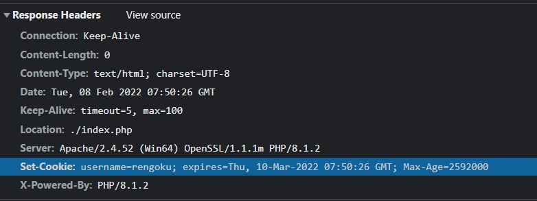

## 資料庫欄位型態 VARCHAR 跟 TEXT 的差別是什麼

CHAR：

- 設定時就要給一個固定長度（如果存的資料長度不夠會自動加上空格）
- 最大長度是 255

VARCHAR：

- 當長度 ≤ 255 時拿 1 byte 來存字串的長度，超過就拿 2 byte
- 最大長度是 65535，可以自己加上長度限制（畢竟都有 var 這個前墜了）
- 字串長度必須在 1~65535 之間，不可以是空值
- 查詢速度比較快

TEXT：

- 會用 2 byte 來存字串的長度
- 最大長度是 65535，不可以自己加上長度限制
- 查詢速度比較慢


簡單來說，能用 VARCHAR 就盡量用 VARCHAR，TEXT 比較適合用在不確定資料有多長的欄位。


## Cookie 是什麼？在 HTTP 這一層要怎麼設定 Cookie，瀏覽器又是怎麼把 Cookie 帶去 Server 的？

備註：下面對於 Session 的定義是指，讓每個 request 之間具有關聯性的一種「機制」。

Cookie 是用來儲存資訊的文字檔（4KB），比較常被用在 Session（但不代表一定要搭配 Session 來用），最廣泛的應用就是登入機制。在 \[BE101\] 做的留言板就是一個實際案例。

Cookie 是由 Server 端來設定的，拿 PHP 來舉例：

```php
setcookie('username', 'rengoku', time() + 3600 * 24 * 30);
```

只要加上這一段，Server 的 response header 就會蹦出一個 `Set-Cookie: value`，




至於瀏覽器怎麼帶 Cookie？我自己是這樣理解的：

> Server：欸瀏覽器，這個 Cookie 給你，你下次來要記得帶著哦！這樣我才知道是你。

瀏覽器在收到這個 Cookie 後，下一次發 reqeust 的時候就會自動帶上 Cookie：


Server 就可以從 Cookie 來得知「哦！原來是大哥（rengoku）呀」，這樣的感覺。

### 補充

關於瀏覽器帶 cookie 的機制前面沒有說到，這邊講完整一點。

簡單來說，Server 在設置 cookie 的時候可以設定 `Path` 來決定瀏覽器要在哪個 domain 帶上（當然 User 也能自己改掉），所以你不會在 `google.com` 帶上 `facebook.com` 的 cookie，這樣就安全許多，也比較合乎常理。


## 我們本週實作的會員系統，你能夠想到什麼潛在的問題嗎？


因為我超前進度被破梗了，所以就說明一下目前已知的問題：

1. XSS 風險

從資料庫輸出資料時，要特別注意有些資料是由使用者來填的，像是帳號、暱稱等等。這種**從 Client 端來的資料都是不安全的**，使用者可以輸入惡意文字來把網頁玩壞，例如：


2. SQL Injection 

跟 XSS 的道理一樣，差別在於一個是塞 `JavaScript` 一個是塞 `SQL`。總之呢，只要是使用者可以輸入的地方都有風險，一樣舉個例子：

（Grapes 把 peanu 的密碼撈出來）


3. 儲存在資料庫的密碼是明文

這個應該是最危險的一點，如果駭客直接駭進資料庫，所有的資料都**清清楚楚躺在那裡**，這是非常可怕的事情。正確的做法是把密碼「雜湊」後再存入資料庫。這樣子就算駭客拿走資料也不知道原文是什麼。

4. 竄改 Cookie

在 cookie 儲存 `username` 的版本，只要把 `username` 改成別人的就可以偽造別人身分來留言了。


最後補充一下我寫的文章，如果想看更多 XSS 跟 SQL Injection 的例子可以參考看看：

- [用 SQL Injection 來玩壞資料庫](https://jubeatt.github.io/2022/02/09/what-is-sql-injection/)
- [從玩壞自己的網站來學習 XSS](https://jubeatt.github.io/2022/02/09/what-is-xss/)